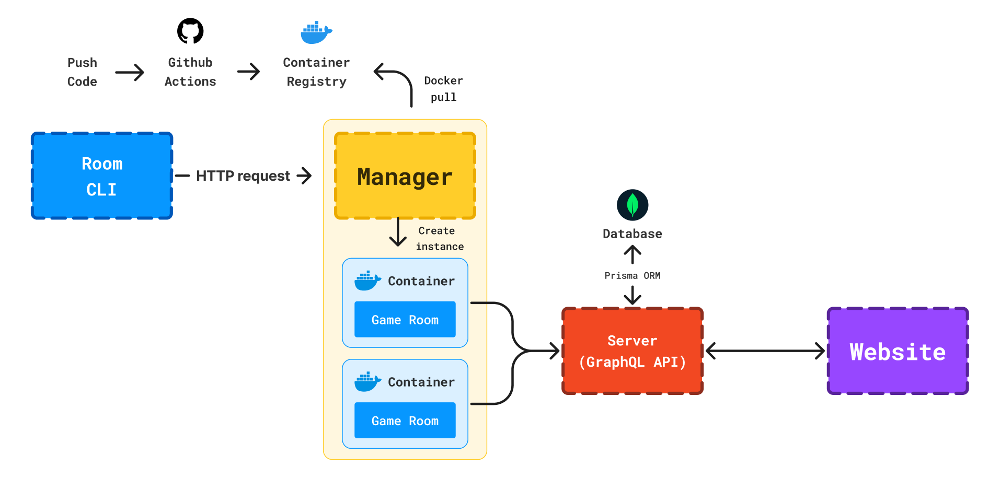

# 👋 Welcome to HaxDock - Scalable Orchestration for HaxBall Rooms

> A full-stack system for managing and scaling HaxBall game rooms using Docker, custom orchestration, and modern TypeScript tooling.

> Originally used in production for managing real HaxBall rooms over multiple years.

---

## 🚀 Key Features

- Custom **Docker-based orchestrator** for managing game room instances
- Dynamic room creation via **HTTP API**
- Real-time communication between game instances and backend
- **GraphQL API** with end-to-end type safety (Prisma + TypeScript)
- Modular architecture (Manager / Server / Website / Rooms)
- CI/CD pipeline with automatic deployment to VPS (GitHub Actions + SSH)

---

## 🧩 Architecture

---

## ⚙️ How It Works

1. Room CLI sends HTTP request to Manager  
2. Manager pulls Docker image and creates a container  
3. Game Room (HaxBall instance) starts inside container  
4. Game Room sends events/statistics to backend  
5. Website communicates with Server via GraphQL API  

---

## 🧠 Architecture Highlights

### Custom Orchestrator (Manager)

Instead of using Kubernetes, the project implements a lightweight custom orchestrator that:

- creates and manages Docker containers
- pulls images from registry
- handles container lifecycle (start / stop / replace)
- streams logs in real time

---

### Shared Logic Across Game Rooms

Each game room (e.g. hockey, futsal) has its own configuration and logic.

To avoid code duplication and maintain consistency, a shared layer (`sharedable`) was introduced:

- contains reusable hooks and utilities
- enforces consistent structure across all rooms
- allows independent room development while sharing core logic

This approach simplifies maintaining multiple room types and reduces duplication.

---

### End-to-End Type Safety

The project ensures type consistency across:

- frontend (React)
- backend (GraphQL)
- database (Prisma + MongoDB)

This reduces runtime errors and improves maintainability.

---

## 🧱 Project Structure

- [room-manager](https://github.com/SMALIE/haxdock/tree/main/manager#readme)  
  → Custom orchestrator responsible for managing Docker containers  

- [server](https://github.com/SMALIE/haxdock/tree/main/server#readme)  
  → Backend (GraphQL API, business logic, database communication)  

- [website](https://github.com/SMALIE/haxdock/tree/main/website#readme)  
  → Frontend application  

- [rooms](https://github.com/SMALIE/haxdock/tree/main/rooms#readme)  
  → Source code for HaxBall game rooms  

---

## 🧠 Challenges & Learnings

- Designing a **custom orchestration system** without Kubernetes  
- Managing Docker containers programmatically using `dockerode`  
- Handling communication between isolated game instances and backend  
- Implementing **end-to-end type safety** across full stack  
- Building CI/CD pipeline with remote deployment over SSH  
- Structuring a modular system with multiple independent services  

---

## ❓ Why

Existing tools for managing HaxBall rooms were limited and not flexible enough.

This project was created to provide a scalable, modular, and developer-friendly way to manage game rooms using modern technologies.

---

## ⚙️ CI/CD & Deployment

The project uses GitHub Actions to:

- build Docker images
- push to registry
- deploy Manager to VPS via SSH
- restart containers automatically

> Note: the original system was maintained as multiple repositories and deployed in production in that form.
> This open-source version was reorganized into a single monorepo for easier presentation and documentation.
> Because of that, some legacy CI/CD workflows may require path adjustments before running.

---

## 🎯 Summary

This project demonstrates:

- system design and architecture skills
- working with Docker and container lifecycle
- backend + frontend integration
- building real-world scalable systems without heavy tooling like Kubernetes
